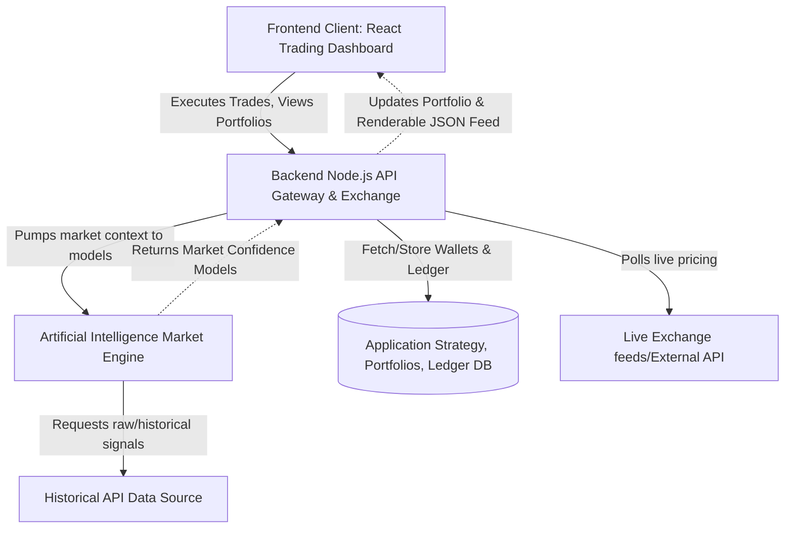
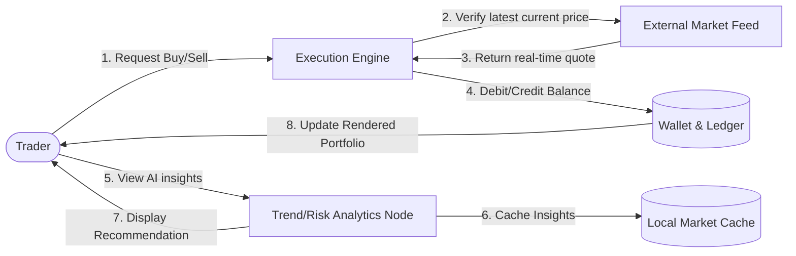

# Milestone 1: Requirement Analysis and System Architecture Design

## 1. Requirements Specifications

### Functional Requirements
1. **Trading Engine**: The system shall process financial transactions, allowing users to execute Buy and Sell orders based on real-time market data.
2. **Portfolio Management**: The system must maintain user-specific wallets and track the performance of their holdings (open positions, P&L, overall portfolio value).
3. **Market Data & Chart Analysis**: The system shall continuously fetch real-time and historical financial metrics to display interactive charts and provide a realistic trading environment.
4. **AI Trading Insights & Recommendations**: The platform will process market feeds and technical indicators (MACD, RSI, Moving Averages) to provide AI-driven insights, trend detection, risk assessments (Beta, volatility), and Buy/Sell/Hold recommendations to guide trades.
5. **Trade History & Order Management**: The system must log all user trades, maintaining a detailed transaction history and performance track record.

### Non-Functional Requirements
1. **System Reliability**: The architecture must ensure 99.9% uptime and implement fail-safes for times when external market data providers are rate-limited or unavailable.
2. **Data Consistency (ACID)**: Transactions must be processed robustly to ensure portfolio balances and transaction logs remain securely consistent, ensuring true financial ledger accuracy.
3. **Scalability**: The backend should handle increasing numbers of concurrent transaction requests and complex AI calculations seamlessly.
4. **Security**: User data, portfolios, and authentication credentials must be stored securely and transmitted over encrypted HTTPS protocol.
5. **Response Time**: UI dashboard components, charts, and trade executions should process in under 1-2 seconds to support high-frequency real market experiences.

---

## 2. System Architecture Design

### High-Level System Architecture
The application (`TradeSense AI Platform`) employs a modern Software-as-a-Service architecture integrating real-time data providers, an order execution backend, predictive models, and intuitive user interfaces.

* **Presentation Layer (Frontend)**: Developed in React.js, presenting interactive dashboards, portfolios, trading interfaces, charts, and real-time visualization of risk insights.
* **Logic/Execution Layer (Backend)**: An API Gateway and Order matching service responsible for managing wallets, executing trades against current market prices, enforcing authentication, and caching market queries.
* **AI & Analytics Layer**: The intelligence core of the application responsible for computing risk coefficients and deriving data-driven Buy/Sell/Hold propositions.
* **Data Sources**: Integrations with external providers (such as Yahoo Finance API, Alpha Vantage, Polygon.io) offering live and historical market context.
* **Database Layer**: Secure storage representing user profiles, portfolios, historical transaction logs, and caching for recent market data.

### System Architecture Diagram



---

## 3. Use-Case and Data Flow Diagrams

### Use-Case Diagram
Highlights the primary interactions between various actors (the user, the AI engine, and the simulated exchange environment) and the top-level analytical functions.

```mermaid
usecase Diagram
actor AppUser as "Trader"
actor AIModel as "AI Insight Engine"
actor DataAPI as "Real-time Financial Data API"

package "TradeSense Trading Software" {
    usecase UC1 as "Manage Portfolio"
    usecase UC2 as "Execute Trade (Buy/Sell)"
    usecase UC3 as "View Market Metrics & Watchlist"
    usecase UC4 as "Receive AI Trade Recommendations"
}

AppUser --> UC1
AppUser --> UC2
AppUser --> UC3
AppUser --> UC4

UC2 .> DataAPI : <<checks execution price against live data>>
UC3 .> DataAPI : <<includes data fetching>>
UC4 .> AIModel : <<delegates to AI>>

AIModel --> DataAPI : <<requests market feeds for training/analysis>>
```

### Data Flow Diagram (DFD Level 1)
Details how data fundamentally navigates from the user executing a mock trade, to portfolio updates.



---
*End of Milestone 1 Report*
